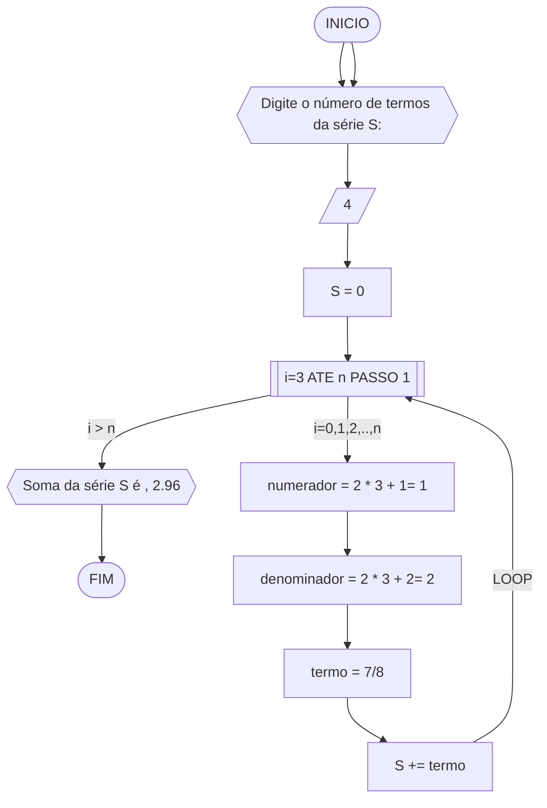
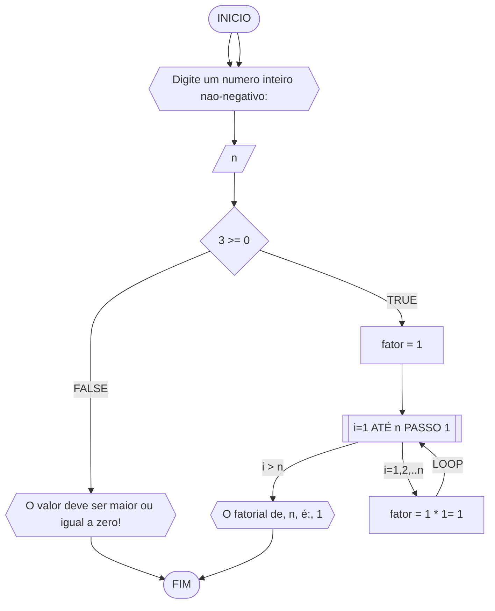
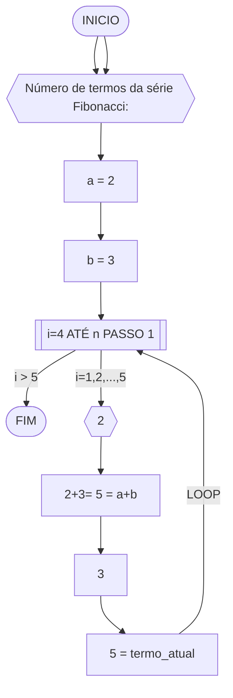
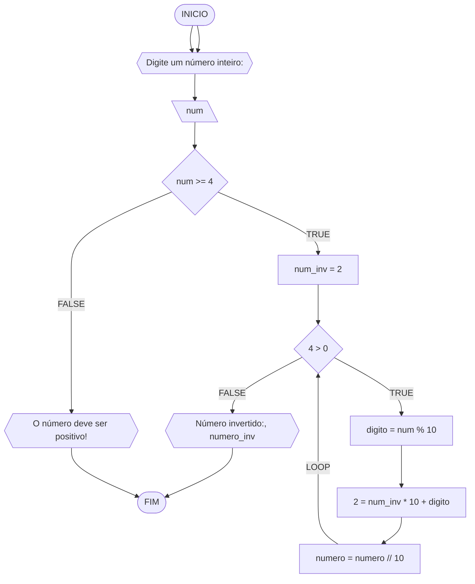

**Curso:** Ciência da Computação  
**Disciplina:** Raciocínio Lógico Algorítmico  
**Código/Turma:** T160-60  
**Professor:** Ricardo Carubbi  
**Data:** 21/03/24  
**Aluno(a):** Davi de Moura Pinheiro  
**Matrícula:** 2413105  

**1a chamada (Sim/Não):** Não  
**2a chamada (Sim/Não):** Sim

## Questão 01 - Troca dos valores de duas variáveis (1 ponto)

Dadas duas variáveis, $a$ e $b$, implemente e teste um algoritmo para trocar os valores atribuídos a elas.

#### Fluxograma:

## Pseudocódigo

ALGORITMO TrocaValores
DECLARE a, b, aux: REAL

INICIO

    // Solicita o usuário a inserir o valor de a
    ESCREVA "Digite o valor de a:"

    // Lê o valor de a inserido pelo usuário
    LEIA a

    // Solicita o usuário a inserir o valor de b
    ESCREVA "Digite o valor de b:"

    // Lê o valor de b inserido pelo usuário
    LEIA b

    // Armazena o valor de a em uma variável auxiliar
    aux <- a 

    // Atribui o valor de b à variável a
    a <- b

    // Atribui o valor armazenado na variável auxiliar à variável b, realizando a troca
    b <- aux

    // Exibe o novo valor de a
    ESCREVA "Novo valor de a: ", a

    // Exibe o novo valor de b
    ESCREVA "Novo valor de b: ", b

FIM

### Questão 2 - Contagem
Dado um conjunto $n$ de notas de alunos em um exame, implemente e teste um algoritmo para fazer uma contagem $cont$ do número de alunos que foram aprovados no exame. Será considerado aprovado o aluno que tirar $nota$ 50 ou maior (no intervalo de 0 a 100).

#### Fluxograma: 

## Pseudocódigo

ALGORITMO ContaAprovacoes
DECLARE n, cont, nota, i: INTEIRO

INICIO

    // Solicita ao usuário que digite a quantidade de notas dos alunos
    ESCREVA "Digite a quantidade de notas dos alunos:"

    // Lê a quantidade de notas fornecida pelo usuário
    LEIA n

    // Inicializa o contador de alunos aprovados
    cont = 0 

    // Itera sobre cada aluno
    PARA i DE 1 ATÉ n FAÇA

        // Solicita ao usuário que digite a nota do aluno atual
        ESCREVA "Digite a nota do aluno ", i, ":"

        // Lê a nota do aluno atual
        LEIA nota

        // Verifica se a nota está no intervalo de aprovação (50 a 100)
        SE nota >= 50 E nota <= 100 ENTAO

            // Incrementa o contador de alunos aprovados
            cont = cont + 1 

        FIM_SE

    FIM_PARA

    // Exibe o número de alunos aprovados
    ESCREVA "O número de alunos aprovados é: ", cont

FIM

#### Questão 3 - Soma de um conjunto de números

Dado um conjunto de $n$ números, implemente e teste um algoritmo para calcular a soma desses números.  
Aceite apenas $n$ maior ou igual a zero.

#### Fluxograma:

## Pseudocódigo

Algoritmo SomaNumeros
DECLARE n, i, soma, num: INTEIRO

INICIO

    // Solicita ao usuário que digite a quantidade de números (n >= 0)
    ESCREVA "Digite a quantidade de números (n >= 0):"
    LEIA n

    // Verifica se n é maior ou igual a 0
    SE n >= 0 ENTAO

        // Inicializa a variável soma
        soma <- 0

        // Inicializa a variável de controle i
        i <- 1

        // Enquanto i for menor ou igual a n, repete o bloco de código
        ENQUANTO i <= n FAÇA

            // Solicita ao usuário que digite um número
            ESCREVA "Digite um número:"
            LEIA num 

            // Adiciona o número digitado à soma
            soma <- soma + num

            // Incrementa i para passar para o próximo número
            i <- i + 1

        FIM_ENQUANTO

    // Se n não for maior ou igual a 0, exibe uma mensagem de erro
    SENAO
        ESCREVA "O valor de n deve ser maior ou igual a zero!"

    FIM_SE

    // Exibe a soma dos números
    ESCREVA "A soma dos números é ", soma

FIM

## Questão 04 - Cálculo de uma série (1 ponto)

Dado um conjunto de $n$ termos da série, implemente e teste um algoritmo para calcular o valor de S, conforme definido abaixo:

#### Fluxograma

## Pseudocódigo

Algoritmo SomaSerie
DECLARE n, numerador, denominador, i: INTEIRO
DECLARE termo, S: REAL

INICIO

    // Solicita ao usuário que digite o número de termos da série S
    ESCREVA "Digite o número de termos da série S:"

    // Lê o número de termos fornecido pelo usuário
    LEIA n

    // Inicializa a variável de soma S
    S <- 0

    // Itera sobre cada termo da série
    PARA i DE 0 ATÉ n-1 PASSO 1 FAÇA

        // Calcula o numerador do termo atual
        numerador <- 2 * i + 1

        // Calcula o denominador do termo atual
        denominador <- 2 * i + 2

        // Calcula o termo atual da série
        termo <- numerador / denominador

        // Adiciona o termo atual à soma S
        S <- S + termo

    FIM_PARA

    // Exibe a soma da série S
    ESCREVA "A soma da série S é ", S

FIM

## Questão 5 - Cálculo Fatorial (2 pontos)

Dado um número n, implemente e teste um algoritmo para calcular o fatorial de n (escrito como n!), onde n>=0.

#### Fluxograma

## Pseudocódigo

ALGORITMO CalcFatorial
DECLARE n, fator, i: INTEIRO

INICIO

    // Solicita ao usuário que digite um número inteiro não-negativo
    ESCREVA "Digite um número inteiro não-negativo:"

    // Lê o número fornecido pelo usuário
    LEIA n

    // Verifica se o número fornecido é não-negativo
    SE n >= 0 ENTAO

        // Inicializa o fatorial como 1
        fator <- 1

        // Calcula o fatorial de n
        PARA i DE 1 ATÉ n PASSO 1 FAÇA

            // Multiplica o fatorial pelo valor atual de i
            fator <- fator * i        // fator *= i

        FIM_PARA

        // Exibe o resultado do fatorial de n
        ESCREVA "O fatorial de ", n, " é: ", fator

    // Se o número fornecido for negativo, exibe uma mensagem de erro
    SENAO
        ESCREVA "O valor deve ser maior ou igual a zero!"
    FIM_SE

FIM

## Questão 6 - Geração da sequência de Fibonacci (2 pontos)

Gerar e imprimir os n primeiros termos da sequência de Fibonacci, onde n>=1. Os primeiros termos são: 0,1,1,2,3,5,8,13,... Cada termo, além dos dois primeiros, é derivado da soma dos seus dois antecessores mais próximos.

#### Fluxograma

## Pseudocódigo

ALGORITMO GeraFibonacci
DECLARE n, a, b, termo_atual: INTEIRO

INICIO

    // Solicita ao usuário o número de termos da série Fibonacci
    ESCREVA "Número de termos da série Fibonacci:"

    // Lê o número fornecido pelo usuário
    LEIA n

    // Inicializa os primeiros dois termos da série Fibonacci
    a <- 0
    b <- 1

    // Itera sobre os próximos termos da série Fibonacci
    PARA i DE 1 ATE n FAÇA

        // Exibe o termo atual da série Fibonacci
        ESCREVA a

        // Calcula o próximo termo da série Fibonacci
        termo_atual <- a + b

        // Atualiza os valores dos termos anteriores para calcular o próximo termo
        a <- b
        b <- termo_atual

    FIM_PARA

FIM

## Questão 7 - Inversão dos dígitos de um número inteiro (2 pontos)

Implemente e teste um algoritmo para inverter a ordem dos dígitos de um número inteiro positivo.

#### Fluxograma

## Pseudocódigo

Algoritmo InverteInteiro
DECLARE num, num_inv, digito: INTEIRO

INICIO

    // Solicita ao usuário que digite o número a ser invertido
    ESCREVA "Digite o número a ser invertido:"
    LEIA num

    // Verifica se o número fornecido é negativo
    SE num < 0 ENTAO

        // Se o número for negativo, exibe uma mensagem de erro
        ESCREVA "O número deve ser positivo!"

    // Se o número fornecido for positivo, realiza a inversão
    SENAO

        // Inicializa a variável que irá armazenar o número invertido
        num_inv <- 0

        // Loop para inverter o número
        ENQUANTO num > 0 FAÇA

            // Obtém o último dígito do número
            digito <- num % 10

            // Adiciona o último dígito ao número invertido, deslocando-o uma posição para a esquerda
            num_inv <- (num_inv * 10) + digito

            // Remove o último dígito do número
            num <- num / 10

        // Exibe o número invertido
        ESCREVA "Número invertido:", num_inv

    FIM_SE

FIM

