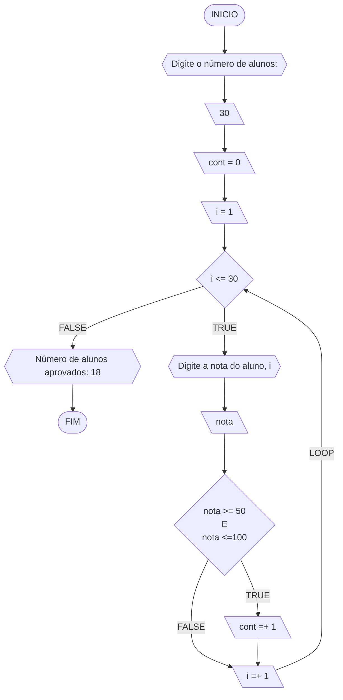
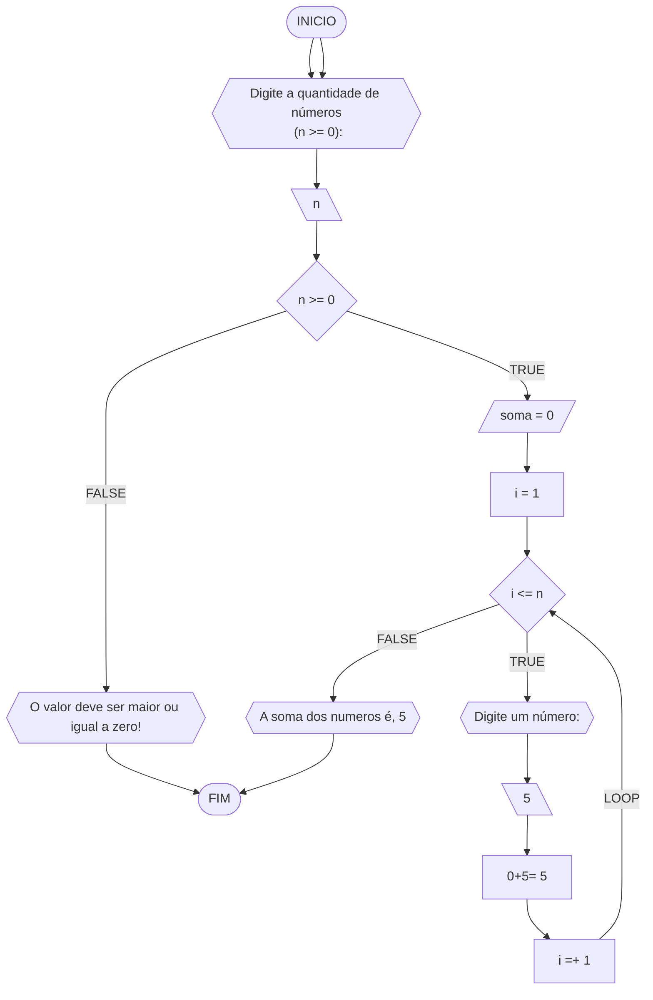

**Curso:** Ciência da Computação  
**Disciplina:** Raciocínio Lógico Algorítmico  
**Código/Turma:** T160-60  
**Professor:** Ricardo Carubbi  
**Data:** 21/03/24  
**Aluno(a):** Davi de Moura Pinheiro  
**Matrícula:** 2413105  

**1a chamada (Sim/Não):** Não  
**2a chamada (Sim/Não):** Sim

## Questão 01 - Troca dos valores de duas variáveis (1 ponto)

Dadas duas variáveis, $a$ e $b$, implemente e teste um algoritmo para trocar os valores atribuídos a elas.

#### Fluxograma:

### Questão 2 - Contagem
Dado um conjunto $n$ de notas de alunos em um exame, implemente e teste um algoritmo para fazer uma contagem $cont$ do número de alunos que foram aprovados no exame. Será considerado aprovado o aluno que tirar $nota$ 50 ou maior (no intervalo de 0 a 100).

#### Fluxograma: 

#### Questão 3 - Soma de um conjunto de números

Dado um conjunto de $n$ números, implemente e teste um algoritmo para calcular a soma desses números.  
Aceite apenas $n$ maior ou igual a zero.

#### Fluxograma:

## Questão 04 - Cálculo de uma série (1 ponto)

Dado um conjunto de $n$ termos da série, implemente e teste um algoritmo para calcular o valor de S, conforme definido abaixo:

