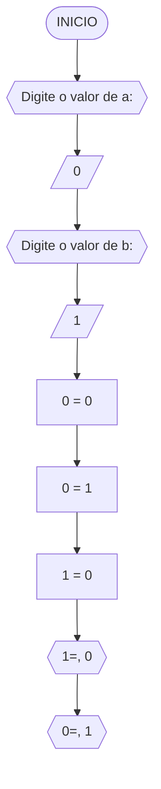

**Curso:** preencha com seus dados  
**Disciplina:** preencha com seus dados  
**Código/Turma:** preencha com seus dados  
**Professor:** Ricardo Carubbi  
**Data:** preencha com a data de envio  
**Aluno(a):** preencha com seus dados  
**Matrícula:** preencha com seus dados  

**1a chamada (Sim/Não):** preencha com a opção correta  
**2a chamada (Sim/Não):** preencha com a opção correta

## Questão 01 - Troca dos valores de duas variáveis (1 ponto)

Dadas duas variáveis, $a$ e $b$, implemente e teste um algoritmo para trocar os valores atribuídos a elas.

#### Fluxograma:

