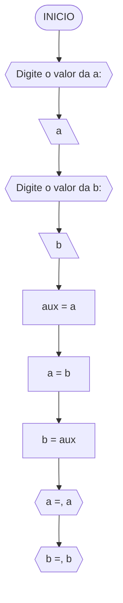
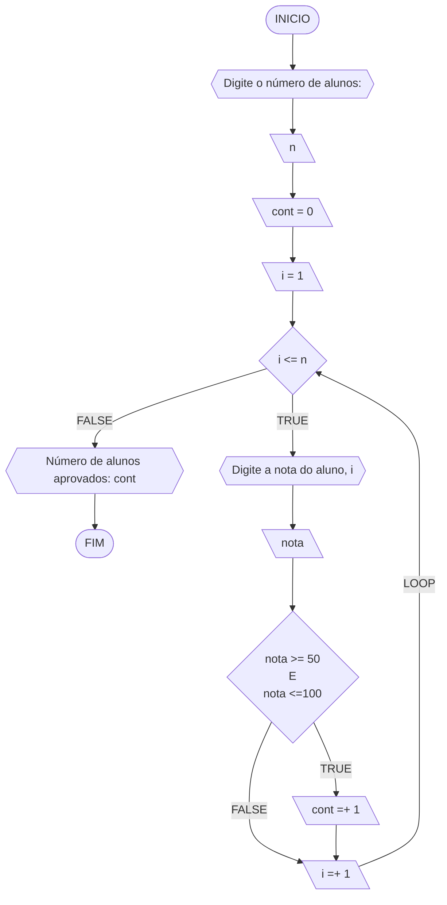
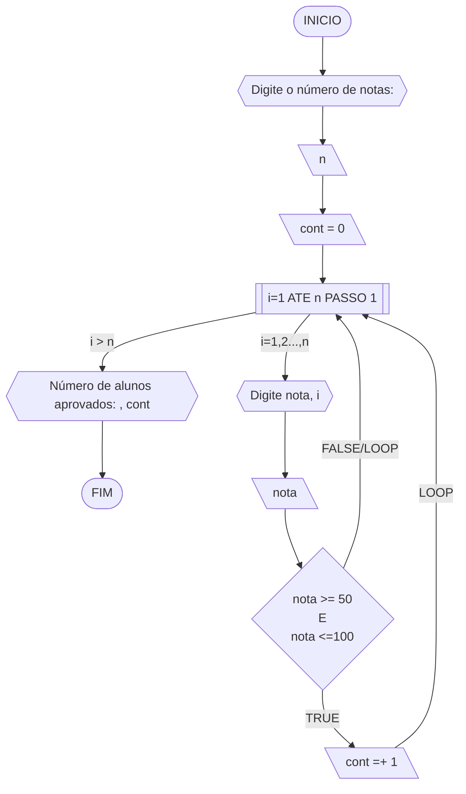
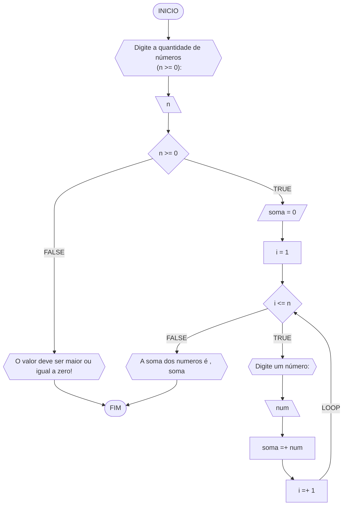
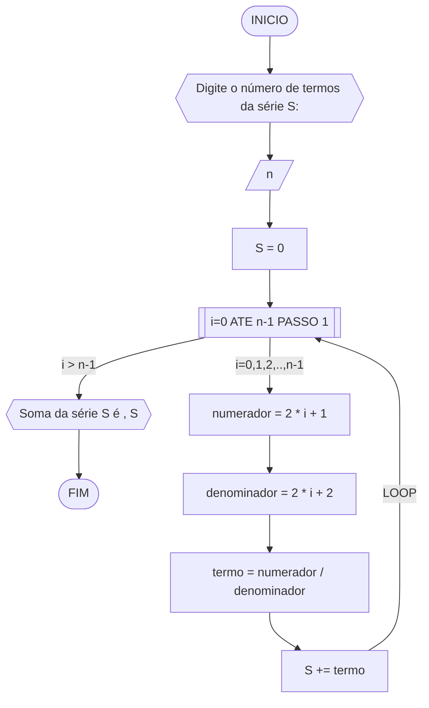
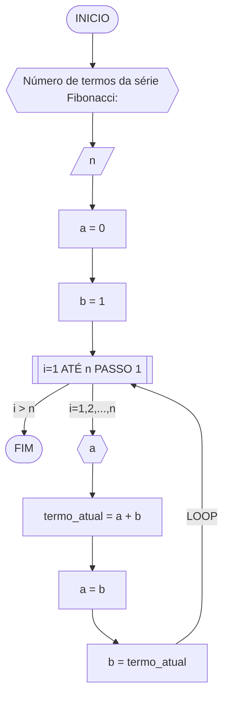
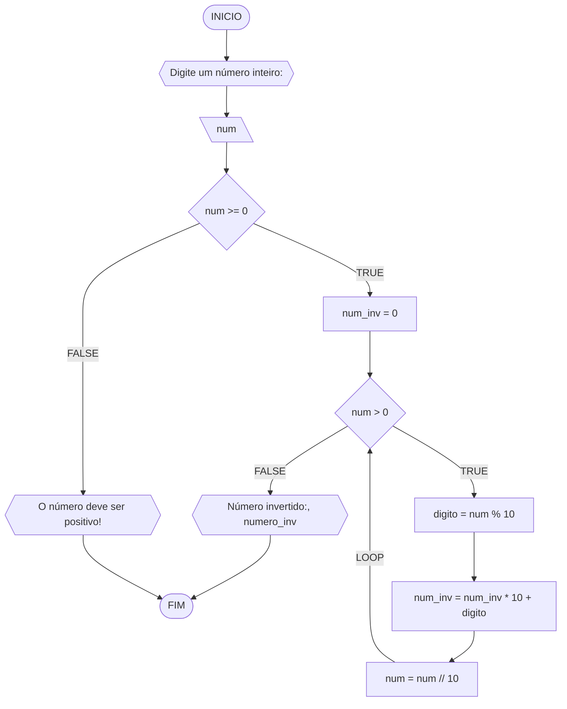

**Curso:** Ciência da Computação  
**Disciplina:** Raciocínio Lógico Algorítmico  
**Código/Turma:** T160-60  
**Professor:** Ricardo Carubbi  
**Data:** 21/03/24  
**Aluno(a):** Davi de Moura Pinheiro  
**Matrícula:** 2413105  

**1a chamada (Sim/Não):** Não  
**2a chamada (Sim/Não):** Sim

## Questão 01 - Troca dos valores de duas variáveis (1 ponto)

Dadas duas variáveis, $a$ e $b$, implemente e teste um algoritmo para trocar os valores atribuídos a elas.

#### Descrição geral do algoritmo

1. Guardar o valor original da variável $a$ em uma variável auxiliar $aux$;
2. Atribuir à variável $a$ o valor original da variável $b$;
3. Atribuir à variável $b$ o valor original da variável $a$, que está armazenado na variável auxiliar $aux$.
4. Exibir os novos valores de $a$ e $b$.

#### Fluxograma

## Pseudocódigo

ALGORITMO TrocaValores
DECLARE a, b, aux: REAL

INICIO

    // Solicita o usuário a inserir o valor de a
    ESCREVA "Digite o valor de a:"

    // Lê o valor de a inserido pelo usuário
    LEIA a

    // Solicita o usuário a inserir o valor de b
    ESCREVA "Digite o valor de b:"

    // Lê o valor de b inserido pelo usuário
    LEIA b

    // Armazena o valor de a em uma variável auxiliar
    aux <- a 

    // Atribui o valor de b à variável a
    a <- b

    // Atribui o valor armazenado na variável auxiliar à variável b, realizando a troca
    b <- aux

    // Exibe o novo valor de a
    ESCREVA "Novo valor de a: ", a

    // Exibe o novo valor de b
    ESCREVA "Novo valor de b: ", b

FIM

#### Tabela de testes

| a  | b  | aux | a  | b  | saída 1 | saída 2 | 
| -- | -- | --  | -- | -- | --      | --      | 
| 0  | 1  | 0   | 1  | 0  | a = 1   | b = 0   |

### Questão 2 - Contagem
Dado um conjunto $n$ de notas de alunos em um exame, implemente e teste um algoritmo para fazer uma contagem $cont$ do número de alunos que foram aprovados no exame. Será considerado aprovado o aluno que tirar $nota$ 50 ou maior (no intervalo de 0 a 100).

#### Descrição geral do algoritmo

1. Obter o número de notas $n$ a serem processadas;
2. Inicializar a contagem $cont$ com zero;
3. Enquanto houver notas a serem processadas, fazer repetidamente:
    - obter a próxima nota;
    - se a nota for suficiente para passar no exame ($n ≥ 50$) então adicionar 1 (um) à contagem $cont$;
4. Exibir a contagem $cont$ (número total de aprovações).

#### Fluxograma 01
Fluxograma conforme descrição do algoritmo acima, usando o loop ENQUANTO.

#### Fluxograma 02
Fluxograma opcional usando o loop PARA.

## Pseudocódigo

ALGORITMO ContaAprovacoes
DECLARE n, cont, nota, i: INTEIRO

INICIO

    // Solicita ao usuário que digite a quantidade de notas dos alunos
    ESCREVA "Digite a quantidade de notas dos alunos:"

    // Lê a quantidade de notas fornecida pelo usuário
    LEIA n

    // Inicializa o contador de alunos aprovados
    cont = 0 

    // Itera sobre cada aluno
    PARA i DE 1 ATÉ n FAÇA

        // Solicita ao usuário que digite a nota do aluno atual
        ESCREVA "Digite a nota do aluno ", i, ":"

        // Lê a nota do aluno atual
        LEIA nota

        // Verifica se a nota está no intervalo de aprovação (50 a 100)
        SE nota >= 50 E nota <= 100 ENTAO

            // Incrementa o contador de alunos aprovados
            cont = cont + 1 

        FIM_SE

    FIM_PARA

    // Exibe o número de alunos aprovados
    ESCREVA "O número de alunos aprovados é: ", cont

FIM
``

#### Tabela de testes 01
Tabela de testes referente ao algoritmo usando o loop ENQUANTO.

| it | n  | i  | cont | i<=n  | nota, i | nota | nota_valida | cont+1 | i+1 | saída        | 
| -- | -- | -- | --   | --    | --      | --   | --          | --     | --  | --           |
| 1  | 3  | 1  |  0   | True  | nota 1  | 60   | True        | 1      | 2   |              |
| 2  | 3  | 2  |  1   | True  | nota 2  | 40   | False       | 1      | 3   |              |
| 3  | 3  | 3  |  1   | True  | nota 3  | 90   | True        | 2      | 4   |              |
| 4  | 3  | 4  |  2   | False |         |      |             |        |     | Aprovados: 2 |

#### Tabela de testes 02
Tabela de testes referente ao algoritmo usando o loop PARA.

| it | n  | cont | i  | nota, i | nota | nota_valida | cont+1 | saída        | 
| -- | -- | --   | -- | --      | --   | --          | --     | --           |
| 1  | 3  | 0    | 1  | nota 1  | 60   | True        | 1      |              |
| 2  | 3  | 1    | 2  | nota 2  | 40   | False       | 1      |              |
| 3  | 3  | 1    | 3  | nota 3  | 90   | True        | 2      | Aprovados: 2 |

#### Questão 3 - Soma de um conjunto de números

Dado um conjunto de $n$ números, implemente e teste um algoritmo para calcular a soma desses números.  
Aceite apenas $n$ maior ou igual a zero.

Dado um conjunto de $n$ números, implemente e teste um algoritmo para calcular a soma desses números.  
Aceite apenas $n$ maior ou igual a zero.

#### Descrição geral do algoritmo

1. Obter a quantidade de números $n$ a serem somados.
2. Inicializar a variável $soma$ com 0 (zero).
3. Enquanto menos do que $n$ números tiverem sido somados, fazer repetidamente:
    - obter o próximo número $i$;
    - calcular a soma atual, adicionando o número $i$ obtido à soma mais recente;
4. Exibir a soma dos $n$ números

#### Fluxograma

## Pseudocódigo

Algoritmo SomaNumeros
DECLARE n, i, soma, num: INTEIRO

INICIO

    // Solicita ao usuário que digite a quantidade de números (n >= 0)
    ESCREVA "Digite a quantidade de números (n >= 0):"
    LEIA n

    // Verifica se n é maior ou igual a 0
    SE n >= 0 ENTAO

        // Inicializa a variável soma
        soma <- 0

        // Inicializa a variável de controle i
        i <- 1

        // Enquanto i for menor ou igual a n, repete o bloco de código
        ENQUANTO i <= n FAÇA

            // Solicita ao usuário que digite um número
            ESCREVA "Digite um número:"
            LEIA num 

            // Adiciona o número digitado à soma
            soma <- soma + num

            // Incrementa i para passar para o próximo número
            i <- i + 1

        FIM_ENQUANTO

    // Se n não for maior ou igual a 0, exibe uma mensagem de erro
    SENAO
        ESCREVA "O valor de n deve ser maior ou igual a zero!"

    FIM_SE

    // Exibe a soma dos números
    ESCREVA "A soma dos números é ", soma

FIM

#### Tabela de testes

| it | n  | n >= 0 | soma | i  | i <= n | num | soma =+ num  | saída                   |
| -- | -- | --     | --   | -- | --     | --  | --           | --                      |
|    | -3 | False  |      |    |        |     |              | O valor deve ser ...    |
| 1  | 0  | True   | 0    | 1  | False  |     |              | A soma dos números é 0  |
| 1  | 3  | True   | 0    | 1  | True   | 5   | 0 + 5 = 5    |                         |
| 2  | 3  | True   | 5    | 2  | True   | 10  | 5 + 10 = 15  |                         |
| 3  | 3  | True   | 15   | 3  | True   | 20  | 15 + 20 = 35 |                         |
| 4  | 3  | True   | 35   | 4  | False  |     |              | A soma dos números é 35 |

## Questão 04 - Cálculo de uma série (1 ponto)

Dado um conjunto de $n$ termos da série, implemente e teste um algoritmo para calcular o valor de S, conforme definido abaixo:

#### Descrição geral do algoritmo

1. Obter o número de termos $n$;
2. Inicializar a variável $S$ com 0 (zero).
3. Iterar o valor de $n$ na variável $i$ iniciando com 0 (zero), de acordo com as instruções abaixo:
    - calcular o numerador na variável $numerador$;
    - calcular o denominador  na variável $denominador$;;
    - calcular o termo da série na variável $termo$, onde $termo = numerador/denominador$;
    - adicionar esse termo à variável $S$.
4. Exibir o valor da série $S$.

#### Fluxograma

## Pseudocódigo

Algoritmo SomaSerie
DECLARE n, numerador, denominador, i: INTEIRO
DECLARE termo, S: REAL

INICIO

    // Solicita ao usuário que digite o número de termos da série S
    ESCREVA "Digite o número de termos da série S:"

    // Lê o número de termos fornecido pelo usuário
    LEIA n

    // Inicializa a variável de soma S
    S <- 0

    // Itera sobre cada termo da série
    PARA i DE 0 ATÉ n-1 PASSO 1 FAÇA

        // Calcula o numerador do termo atual
        numerador <- 2 * i + 1

        // Calcula o denominador do termo atual
        denominador <- 2 * i + 2

        // Calcula o termo atual da série
        termo <- numerador / denominador

        // Adiciona o termo atual à soma S
        S <- S + termo

    FIM_PARA

    // Exibe a soma da série S
    ESCREVA "A soma da série S é ", S

FIM
``

#### Tabela de testes (0.25 ponto)

| it | n  | S  | i | numerador | denominador | termo | S += termo     | saída                  |
| -- | -- | -- |-- | --        | --          | --    | --             | --                     |
|    | 0  | 0  |   |           |             |       |                |                        |
| 1  | 4  | 0  | 0 | 2*0+1 = 1 | 2*0+2 = 2   | 1/2   | 0+1/2 = 1/2    |                        |
| 2  | 4  | 0  | 1 | 2*1+1 = 1 | 2*1+2 = 2   | 3/4   | 1/2+3/4 = 1.25 |                        |
| 3  | 4  | 0  | 2 | 2*2+1 = 1 | 2*2+2 = 2   | 5/6   | 0+1/2 = 2.08   |                        |
| 4  | 4  | 0  | 3 | 2*3+1 = 1 | 2*3+2 = 2   | 7/8   | 0+1/2 = 2.96   | Soma da série S é 2.96 |

## Questão 5 - Cálculo Fatorial (2 pontos)

Dado um número n, implemente e teste um algoritmo para calcular o fatorial de n (escrito como n!), onde n>=0.

## Pseudocódigo

ALGORITMO CalcFatorial
DECLARE n, fator, i: INTEIRO

INICIO

    // Solicita ao usuário que digite um número inteiro não-negativo
    ESCREVA "Digite um número inteiro não-negativo:"

    // Lê o número fornecido pelo usuário
    LEIA n

    // Verifica se o número fornecido é não-negativo
    SE n >= 0 ENTAO

        // Inicializa o fatorial como 1
        fator <- 1

        // Calcula o fatorial de n
        PARA i DE 1 ATÉ n PASSO 1 FAÇA

            // Multiplica o fatorial pelo valor atual de i
            fator <- fator * i        // fator *= i

        FIM_PARA

        // Exibe o resultado do fatorial de n
        ESCREVA "O fatorial de ", n, " é: ", fator

    // Se o número fornecido for negativo, exibe uma mensagem de erro
    SENAO
        ESCREVA "O valor deve ser maior ou igual a zero!"
    FIM_SE

FIM

## Questão 6 - Geração da sequência de Fibonacci (2 pontos)

Gerar e imprimir os n primeiros termos da sequência de Fibonacci, onde n>=1. Os primeiros termos são: 0,1,1,2,3,5,8,13,... Cada termo, além dos dois primeiros, é derivado da soma dos seus dois antecessores mais próximos.

#### Descrição geral do algoritmo

1. Obter o número de termos $n$, onde $n \geq 1$;
2. Inicializar os dois primeiros termos da série nas variável $a$ e $b$ com 0 (zero);
3. Iterar o valor de $n$, ou seja, executar $n$ vezes, as instruções abaixo:
    - Imprimir o termo inicial $a$ (instrução para exibir a sequência ao atualizar a variável $a$);
    - Somar os termos $a$ e $b$ na variável $termo_atual$;
    - Atribuir a variável $a$ o valor da variável $b$;
    - Atribuir a variável $b$ o valor da variável $termo_atual$.

#### Fluxograma

## Pseudocódigo

ALGORITMO GeraFibonacci
DECLARE n, a, b, termo_atual: INTEIRO

INICIO

    // Solicita ao usuário o número de termos da série Fibonacci
    ESCREVA "Número de termos da série Fibonacci:"

    // Lê o número fornecido pelo usuário
    LEIA n

    // Inicializa os primeiros dois termos da série Fibonacci
    a <- 0
    b <- 1

    // Itera sobre os próximos termos da série Fibonacci
    PARA i DE 1 ATE n FAÇA

        // Exibe o termo atual da série Fibonacci
        ESCREVA a

        // Calcula o próximo termo da série Fibonacci
        termo_atual <- a + b

        // Atualiza os valores dos termos anteriores para calcular o próximo termo
        a <- b
        b <- termo_atual

    FIM_PARA

FIM
``

#### Tabela de testes

| it | n  | a  | b  | i  | saída | termo_atual = a + b | a = b | b = termo_atual |
| -- | -- | -- | -- | -- | --    | --                  | --    | --              |
| 1  | 5  | 0  | 1  | 1  | 0     | 0 + 1 = 1           | 1     | 1               |
| 2  | 5  | 1  | 1  | 2  | 1     | 1 + 1 = 2           | 1     | 2               |
| 3  | 5  | 1  | 2  | 3  | 1     | 1 + 2 = 3           | 2     | 3               |
| 4  | 5  | 2  | 3  | 4  | 2     | 2 + 3 = 5           | 3     | 5               |
| 4  | 5  | 3  | 5  | 5  | 3     | 3 + 5 = 8           | 5     | 8               |
``

## Questão 7 - Inversão dos dígitos de um número inteiro (2 pontos)

Implemente e teste um algoritmo para inverter a ordem dos dígitos de um número inteiro positivo.

#### Descrição geral do algoritmo

1. Obter o número inteiro positivo $num$ a ser invertido;
2. Inicializar a variável $num \textunderscore inv$ com 0 (zero);
3. Enquanto o número for maior que zero ($num > 0$), faça repetidamente:
    - Calcular o último dígito do número na variável $digito$;
    - Adicionar o dígito ao número invertido $num \textunderscore inv$;
    - Remover o último dígito do número original $num$; 
4. Exibir o número invertido.

#### Fluxograma

## Pseudocódigo

Algoritmo InverteInteiro
DECLARE num, num_inv, digito: INTEIRO

INICIO

    // Solicita ao usuário que digite o número a ser invertido
    ESCREVA "Digite o número a ser invertido:"
    LEIA num

    // Verifica se o número fornecido é negativo
    SE num < 0 ENTAO

        // Se o número for negativo, exibe uma mensagem de erro
        ESCREVA "O número deve ser positivo!"

    // Se o número fornecido for positivo, realiza a inversão
    SENAO

        // Inicializa a variável que irá armazenar o número invertido
        num_inv <- 0

        // Loop para inverter o número
        ENQUANTO num > 0 FAÇA

            // Obtém o último dígito do número
            digito <- num % 10

            // Adiciona o último dígito ao número invertido, deslocando-o uma posição para a esquerda
            num_inv <- (num_inv * 10) + digito

            // Remove o último dígito do número
            num <- num / 10

        // Exibe o número invertido
        ESCREVA "Número invertido:", num_inv

    FIM_SE

FIM
``

#### Tabela de testes

| it | num | num_inv | num > 0 | digito | num = num // 10 | num_inv = (num_inv * 10) + digito | Saída                        |
| -- | --  | --      | --     | --      | --              | --                                | --                           |
|    | -1  | 0       | False  |         |                 |                                   | O número deve ser positivo!  |
| 1  | 0   | 0       | False  |         |                 |                                   | Número invertido:: 0         |
| 1  | 42  | 0       | True   | 2       | 4               | 2                                 |                              |
| 2  | 4   | 2       | True   | 4       | 0               | 24                                |                              |
| 3  | 0   | 24      | False  |         |                 |                                   | Número invertido:: 24        |

