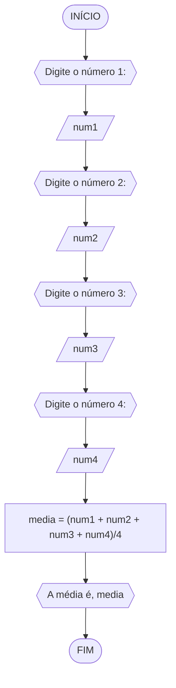
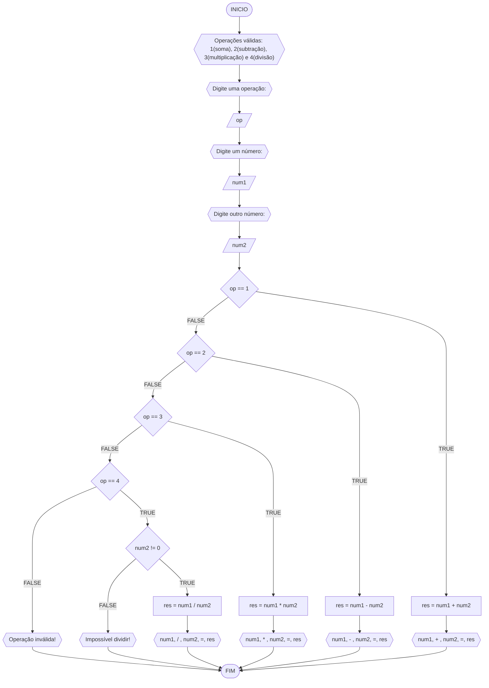
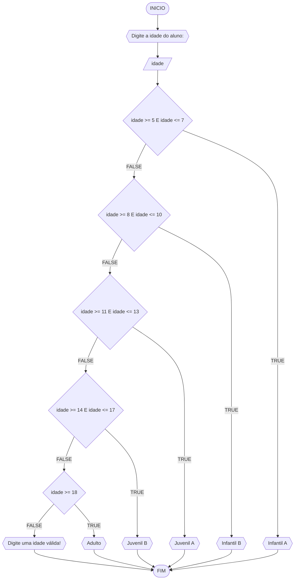

# UNIFOR
**Nome**: Davi de Moura Pinheiro
**Disciplina**: Raciocínio Lógico Algorítmo

## Exercício 01 

Calcule a média de quatro números inteiros dados.

#### Fluxograma (1.0 ponto)



## Pseudocódigo (1.0 ponto)

```java
ALGORTIMO Media
DECLARE num1, num2, num3, num4: REAL

INÍCIO

    // Solicita ao usuário que digite o número 1
    ESCREVA "Digite o número 1:"
    
    // Lê o número 1 fornecido pelo usuário
    LEIA num1

    // Solicita ao usuário que digite o número 2
    ESCREVA "Digite o número 2:"
    
    // Lê o número 2 fornecido pelo usuário
    LEIA num2

    // Solicita ao usuário que digite o número 3
    ESCREVA "Digite o número 3:"
    
    // Lê o número 3 fornecido pelo usuário
    LEIA num3

    // Solicita ao usuário que digite o número 4
    ESCREVA "Digite o número 4:"
    
    // Lê o número 4 fornecido pelo usuário
    LEIA num4

    // Calcula a média dos quatro números
    media <- (num1 + num2 + num3 + num4) / 4
    
    // Exibe a média
    ESCREVA "A média é", media

FIM
```

#### Teste de mesa (0.5 ponto)
| sal | prof | prof == “Técnico” | prof = “Gerente” | sal_reaj | Saída |
| -- | -- | -- | -- | -- | -- |
| 1000 | Técnico | V | F | 1500 | “Salário Reajustado = 1500“ |
| 2000 | Gerente | F | V | 2600 | “Salário Reajustado = 2600“ |
| 9000 | Diretor | F | F | 9900 | “Salário Reajustado = 9900“ |

## Lista de exercícios 02

### Exercício 01 (2.5 pontos)
Calcule a média de quatro números inteiros dados.

#### Fluxograma (1.0 ponto)

```mermaid
flowchart TD
A([INICIO]) --> B{{"Digite o número 1:"}}
B --> C[/num1/]
C --> D{{"Digite o número 2:"}}
D --> E[/num2/]
E --> F{{"Digite o número 3:"}}
F --> G[/num3/]
G --> H{{"Digite o número 4:"}}  // Corrigi o rótulo para "Digite o número 4:"
H --> I[/num4/]
I --> J["media = (num1 + num2 + num3 + num4)/4"]
J --> K{{"A média é " + media}}  // Corrigi a formatação para mostrar a média
K --> L([FIM])
```

#### Pseudocódigo (1.0 ponto)

```java
ALGORITMO Media
DECLARE num1, num2, num3, num4: REAL

INICIO

    // Solicita ao usuário que insira o primeiro número
    ESCREVA "Digite o primeiro número:"
    
    // Lê o primeiro número inserido pelo usuário
    LEIA num1

    // Solicita ao usuário que insira o segundo número
    ESCREVA "Digite o segundo número:"
    
    // Lê o segundo número inserido pelo usuário
    LEIA num2

    // Solicita ao usuário que insira o terceiro número
    ESCREVA "Digite o terceiro número:"
    
    // Lê o terceiro número inserido pelo usuário
    LEIA num3

    // Solicita ao usuário que insira o quarto número
    ESCREVA "Digite o quarto número:"
    
    // Lê o quarto número inserido pelo usuário
    LEIA num4

    // Calcula a média dos números inseridos
    media <- (num1 + num2 + num3 + num4) / 4
    
    // Exibe a média calculada
    ESCREVA "A média é", media

FIM
```

### Teste de mesa (0.5 ponto)

| num1 | num2 | num3 | num4 | saída | 
| --   | --   | --   | --   | --    | 
| 0.25 | 0.25 | 2.50 | 1.00 | 1.00  | 

### Exercício 02 (2.5 pontos)
Leia uma temperatura dada em Celsius (C) e imprima o equivalente em Fahrenheit (F). (Fórmula de conversão: F = (9/5) * C + 32)

#### Fluxograma (1.0 ponto)

```mermaid
flowchart TD
A([INICIO]) --> B{{"Digite a temperatura em Celsius:"}}
B --> C[/C/]
C --> D["F = (9/5) * C + 32"]
D --> E{{"A temperatura em Fahrenheit é " + F + " graus"}}
E --> F([FIM])
```

#### Pseudocódigo (1.0 ponto)

```java
ALGORITMO ConverteCelsiusFarenheit
DECLARE Celsius, Fahrenheit: REAL

INICIO

    // Solicita ao usuário que insira a temperatura em Celsius
    ESCREVA "Digite a temperatura em Celsius:"

    // Lê a temperatura inserida pelo usuário
    LEIA Celsius

    // Converte a temperatura de Celsius para Fahrenheit
    Fahrenheit <- (9/5) * Celsius + 32

    // Exibe a temperatura convertida em Fahrenheit
    ESCREVA "A temperatura em Fahrenheit é", Fahrenheit, "graus"

FIM
```

#### Teste de mesa (0.5 ponto)

| C  | F  | saída                                  | 
| -- | -- | --                                     |
| 0  | 32 | A temperatura em Fahrenheit é 32 graus |

### Exercício 03 (2.5 pontos)
Receba dois números reais e um operador e efetue a operação correspondente com os valores recebidos (operandos). 
O algoritmo deve retornar o resultado da operação selecionada simulando todas as operações de uma calculadora simples.

#### Fluxograma (1.0 ponto)



#### Pseudocódigo (1.0 ponto)

```java
ALGORITMO CalculadoraSimples
DECLARE op: INTEIRO; num1, num2, res: REAL

INICIO

    // Informa ao usuário sobre as operações válidas
    ESCREVA "Operações válidas: 1 (soma), 2 (subtração), 3 (multiplicação) e 4 (divisão)"

    // Solicita ao usuário que digite uma operação
    ESCREVA "Digite uma operação:"
    
    // Lê a operação inserida pelo usuário
    LEIA op

    // Solicita ao usuário que digite o primeiro número
    ESCREVA "Digite um número:"
    LEIA num1

    // Solicita ao usuário que digite o segundo número
    ESCREVA "Digite outro número:"
    LEIA num2

    // Executa a escolha da operação
    ESCOLHA

        // Caso a operação seja soma
        CASO op == 1
            res <- num1 + num2
            ESCREVA num1, "+", num2, "=", res

        // Caso a operação seja subtração
        CASO op == 2
            res <- num1 - num2
            ESCREVA num1, "-", num2, "=", res

        // Caso a operação seja multiplicação
        CASO op == 3
            res <- num1 * num2
            ESCREVA num1, "*", num2, "=", res

        // Caso a operação seja divisão
        CASO op == 4
            SE num2 != 0 ENTAO
                res <- num1 / num2
                ESCREVA num1, "/", num2, "=", res
            SENAO
                ESCREVA "Impossível dividir!"

    // Se a operação inserida for inválida
    SENAO
        ESCREVA "Operação inválida!"

    FIM_ESCOLHA

FIM
```

#### Teste de mesa (0.5 ponto)

| num1 | num2 | op | num2 != 0 | res | saída               | 
| --   | --   | -- | --        | --  | --                  |
| 1    | 0    | 1  |           | 1   | 1 + 0 = 1           |
| 1    | 0    | 2  |           | 1   | 1 - 0 = 1           |
| 1    | 0    | 3  |           | 0   | 1 * 0 = 0           |
| 1    | 0    | 4  | False     |     | Impossível dividir! |
| 1    | 2    | 4  | True      | 0.5 | 1 / 2 = 0,5         |
| 1    | 2    | 5  |           |     | Operação inválida!  |

### Exercício 04 (2.5 pontos)
Elaborar um algoritmo que, dada a idade, classifique nas categorias: infantil A (5 - 7 anos), infantil B (8 - 10 anos), juvenil A (11 - 13 anos), juvenil B (14 - 17 anos) e adulto (maiores que 18 anos).

#### Fluxograma (1.0 ponto)



#### Pseudocódigo (1.0 ponto)

```java
ALGORITMO ClassificaCategoria
DECLARE idade: INTEIRO

INICIO

    // Solicita ao usuário que digite a idade do aluno
    ESCREVA "Digite a idade do aluno:"
    
    // Lê a idade inserida pelo usuário
    LEIA idade

    // Classifica a categoria do aluno com base na idade
    ESCOLHA

        // Caso a idade esteja entre 5 e 7 anos
        CASO idade >= 5 E idade <= 7
            ESCREVA "Infantil A"

        // Caso a idade esteja entre 8 e 10 anos
        CASO idade >= 8 E idade <= 10
            ESCREVA "Infantil B"

        // Caso a idade esteja entre 11 e 13 anos
        CASO idade >= 11 E idade <= 13
            ESCREVA "Juvenil A"

        // Caso a idade esteja entre 14 e 17 anos
        CASO idade >= 14 E idade <= 17
            ESCREVA "Juvenil B"

        // Caso a idade seja igual ou superior a 18 anos
        CASO idade >= 18
            ESCREVA "Adulto"

    // Caso a idade inserida não esteja em nenhuma faixa válida
    SENAO
        ESCREVA "Digite uma idade válida!"

    FIM_ESCOLHA

FIM
```

#### Teste de mesa (0.5 ponto)

| idade | idade >=8 E idade <= 10 | idade >=11 E idade <= 13 | idade >=14 E idade <= 17 | idade >=18 | saída                       | 
| --    | --                      | --                       | --                       | --         | --                          |
| 4     | False                   | False                    | False                    | False      | Digite uma idade válida!    |
| -4    | False                   | False                    | False                    | False      | Digite uma idade válida!    |
| 8     | True                    | False                    | False                    | False      | Infantial A                 |
| 11    | False                   | True                     | False                    | False      | Infantial B                 |
| 17    | False                   | False                    | True                     | False      | Infantial C                 |
| 21    | False                   | False                    | False                    | True       | Adulto                      |


 


